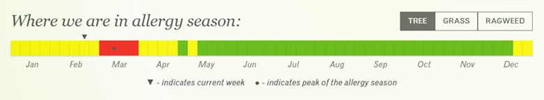
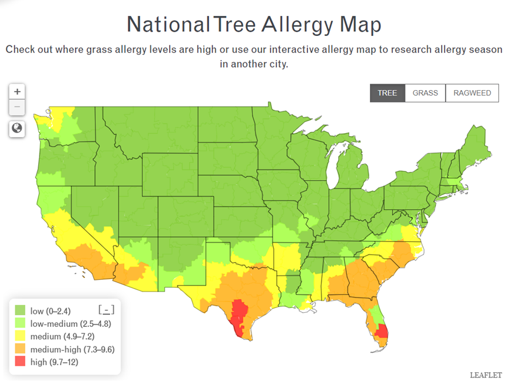
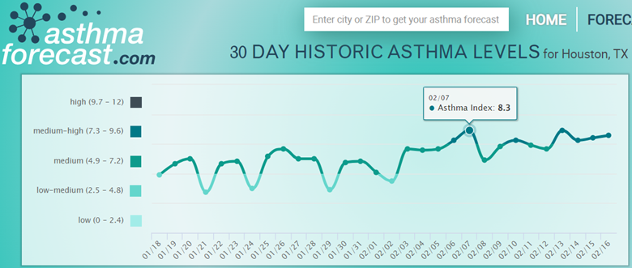

---
authors:
- admin
date: "2023-02-17T00:00:00Z"
draft: false
featured: false
image: 
  caption: ""
  focal_point: ""
subtitle: 
summary: "In this blog, I investigate whether my recent trouble with breathing could be related to air quality and/or allergies."
title: "Why can't I breathe?"
toc: true
output:
  blogdown::html_page:
    toc: true
---

<!-- have to knit first if .Rmd -->
<!-- Note to self: some of the tables like kablextra and reactable broke the format of the blog, so using gt -->
<style type="text/css">

body {
  font-size: 15pt;
}


p2 {
  font-size: 16pt;
  font-weight: bold;
  text-align: center;
}


h1 { /* Header 1 */
  font-size: 32px;
  color: DarkBlue;
  font-weight: bold;
}

h2 { /* Header 2 */
  font-size: 24px;
  color: DarkBlue;
  font-weight: bold;
}

h3 { /* Header 3 */
  font-size: 20px;
  color: DarkBlue;
  font-weight: bold;
}

</style>

# Background

For the past 3 weeks I’ve found it difficult to breathe and felt like for the first time in my life my asthma was not under control. I couldn’t stop coughing, my chest constantly felt tight, and sometimes even talking was totally exhausting.

As someone who’s lived in many cities including Baltimore, Syracuse, and Sydney, I know that allergies and asthma can change with different climates and geographic locations. My most recent move has brought me to Houston, Texas.

Living in the states most of my life, I was prepared for my allergies to be bad in the fall. So I was pleasantly surprised when I hardly noticed any allergy symptoms during my first fall in Houston. I did end up getting Covid last October, but even then I didn’t experience any trouble breathing.

So what has triggered my asthma these past few weeks? In this blog post, I investigate whether it could be related to air quality and/or allergies.

# **Air Quality** in Houston

I’ll start off with exploring air quality because I happened to listen to a podcast the other week on Science Vs. called [“A Mystery in the Air”](https://gimletmedia.com/shows/science-vs/94hxnjn). This episode tells the story of Ella Adoo-Kissi-Debrah who tragically died at only 9 years old. Ella was a healthy girl until she started experiencing severe asthma triggered by poor air quality that ultimately ended up leading to her death. Ella was the first person in the UK to have air pollution listed as a cause of death. I recommend listening to the podcast to hear Ella’s story or checking out this [BBC article](https://www.bbc.com/news/uk-england-london-56801794) for more information.

This podcast made me think more seriously about air quality - something I’ve always taken for granted. Houston is a major city… with a lot of traffic! I’ve only lived here for about 6 months, but I live in the heart of the city. I’ve never bothered to check air quality before, but after listening to the podcast and hearing Ella’s story and knowing how much my asthma has been acting up lately, I was curious to learn more about the air quality around me.

So let’s look at some data! I’ll get my data from [Open Weather API](https://openweathermap.org/api/air-pollution). This is free, but you need to sign up in order to get an API key.

*Check out my previous blog on [“My First API: Which NFL games should I watch?”](https://jennysloane.netlify.app/blog/nfl/) for a more thorough walk through of using APIs in R*

## Calling the Open Weather API

The first thing to do is call the API to get the historic data. To do this, in the first code chunk below, I created a function to get the API data. I turned this into a function because I’ll end up recycling this code again later.

This function makes 2 GET requests:

1.  The first GET request gets the longitude and latitude of the city passed in the function.
2.  The second GET request uses the longitude and latitude data from the first GET request along with start and end dates to pull the historic data.

The function returns the historic data.

``` r
# loading libraries
library(tidyverse) 
library(httr)
library(glue)
library(gt)
library(lubridate)
library(ggeasy)
library(ggrepel)
library(RColorBrewer)
library(here)

setwd(here("content/blog/air_quality/"))

source("api_key.R") # this source code contains my API key

city_function <- function(api_key, my_city, my_state, my_country, start_time, end_time) {
  
  # parameters
  api_key = api_key # taken from the source code
  city = my_city
  state = my_state
  country = my_country
  start = start_time
  end = end_time
  
  # GET request #1
  res_lat_long = GET(glue('http://api.openweathermap.org/geo/1.0/direct?q={city},{state},{country}&appid={api_key}'))

  lat_long <- content(res_lat_long, as="text")
  lat_long <- jsonlite::fromJSON(lat_long, flatten=TRUE) 
  
  lat = lat_long$lat
  lon = lat_long$lon
  
  # GET request #2 
  res_historic_data = GET(glue('http://api.openweathermap.org/data/2.5/air_pollution/history?lat={lat}&lon={lon}&start={start}&end={end}&appid={api_key}'))
  
  historic_data <- content(res_historic_data, as="text")
  historic_data <- jsonlite::fromJSON(historic_data, flatten=TRUE)

  return(historic_data$list)
}
```

## Getting Houston Data

Now that I have my function ready to go, let’s get data from Houston between August 12, 2022 and February 12, 2023.

-   Looking at the API documentation, I noticed the start and end times were in a weird format. For example it says: `Start date (unix time, UTC time zone), e.g. start=1606488670`.

-   I had never heard of unix time before, so naturally I Googled it. Turns out, unix time is a way to track time in seconds and the count starts at the Unix Epoch on January 1st, 1970 at UTC. Fortunately, I also found [this website](https://www.unixtimestamp.com/) to easily convert dates to unix time.

    -   August 12, 2022 = 1660280400
    -   February 19, 2023 = 1676786400

``` r
houston <- city_function(api_key, my_city = "Houston", my_state = "TX", my_country = "US", start_time = 1660280400, end_time = 1676786400)

houston %>%
  head(10) %>%
  gt()
```

<div id="plqewubgtw" style="overflow-x:auto;overflow-y:auto;width:auto;height:auto;">
<style>html {
  font-family: -apple-system, BlinkMacSystemFont, 'Segoe UI', Roboto, Oxygen, Ubuntu, Cantarell, 'Helvetica Neue', 'Fira Sans', 'Droid Sans', Arial, sans-serif;
}

#plqewubgtw .gt_table {
  display: table;
  border-collapse: collapse;
  margin-left: auto;
  margin-right: auto;
  color: #333333;
  font-size: 16px;
  font-weight: normal;
  font-style: normal;
  background-color: #FFFFFF;
  width: auto;
  border-top-style: solid;
  border-top-width: 2px;
  border-top-color: #A8A8A8;
  border-right-style: none;
  border-right-width: 2px;
  border-right-color: #D3D3D3;
  border-bottom-style: solid;
  border-bottom-width: 2px;
  border-bottom-color: #A8A8A8;
  border-left-style: none;
  border-left-width: 2px;
  border-left-color: #D3D3D3;
}

#plqewubgtw .gt_heading {
  background-color: #FFFFFF;
  text-align: center;
  border-bottom-color: #FFFFFF;
  border-left-style: none;
  border-left-width: 1px;
  border-left-color: #D3D3D3;
  border-right-style: none;
  border-right-width: 1px;
  border-right-color: #D3D3D3;
}

#plqewubgtw .gt_title {
  color: #333333;
  font-size: 125%;
  font-weight: initial;
  padding-top: 4px;
  padding-bottom: 4px;
  padding-left: 5px;
  padding-right: 5px;
  border-bottom-color: #FFFFFF;
  border-bottom-width: 0;
}

#plqewubgtw .gt_subtitle {
  color: #333333;
  font-size: 85%;
  font-weight: initial;
  padding-top: 0;
  padding-bottom: 6px;
  padding-left: 5px;
  padding-right: 5px;
  border-top-color: #FFFFFF;
  border-top-width: 0;
}

#plqewubgtw .gt_bottom_border {
  border-bottom-style: solid;
  border-bottom-width: 2px;
  border-bottom-color: #D3D3D3;
}

#plqewubgtw .gt_col_headings {
  border-top-style: solid;
  border-top-width: 2px;
  border-top-color: #D3D3D3;
  border-bottom-style: solid;
  border-bottom-width: 2px;
  border-bottom-color: #D3D3D3;
  border-left-style: none;
  border-left-width: 1px;
  border-left-color: #D3D3D3;
  border-right-style: none;
  border-right-width: 1px;
  border-right-color: #D3D3D3;
}

#plqewubgtw .gt_col_heading {
  color: #333333;
  background-color: #FFFFFF;
  font-size: 100%;
  font-weight: normal;
  text-transform: inherit;
  border-left-style: none;
  border-left-width: 1px;
  border-left-color: #D3D3D3;
  border-right-style: none;
  border-right-width: 1px;
  border-right-color: #D3D3D3;
  vertical-align: bottom;
  padding-top: 5px;
  padding-bottom: 6px;
  padding-left: 5px;
  padding-right: 5px;
  overflow-x: hidden;
}

#plqewubgtw .gt_column_spanner_outer {
  color: #333333;
  background-color: #FFFFFF;
  font-size: 100%;
  font-weight: normal;
  text-transform: inherit;
  padding-top: 0;
  padding-bottom: 0;
  padding-left: 4px;
  padding-right: 4px;
}

#plqewubgtw .gt_column_spanner_outer:first-child {
  padding-left: 0;
}

#plqewubgtw .gt_column_spanner_outer:last-child {
  padding-right: 0;
}

#plqewubgtw .gt_column_spanner {
  border-bottom-style: solid;
  border-bottom-width: 2px;
  border-bottom-color: #D3D3D3;
  vertical-align: bottom;
  padding-top: 5px;
  padding-bottom: 5px;
  overflow-x: hidden;
  display: inline-block;
  width: 100%;
}

#plqewubgtw .gt_group_heading {
  padding-top: 8px;
  padding-bottom: 8px;
  padding-left: 5px;
  padding-right: 5px;
  color: #333333;
  background-color: #FFFFFF;
  font-size: 100%;
  font-weight: initial;
  text-transform: inherit;
  border-top-style: solid;
  border-top-width: 2px;
  border-top-color: #D3D3D3;
  border-bottom-style: solid;
  border-bottom-width: 2px;
  border-bottom-color: #D3D3D3;
  border-left-style: none;
  border-left-width: 1px;
  border-left-color: #D3D3D3;
  border-right-style: none;
  border-right-width: 1px;
  border-right-color: #D3D3D3;
  vertical-align: middle;
}

#plqewubgtw .gt_empty_group_heading {
  padding: 0.5px;
  color: #333333;
  background-color: #FFFFFF;
  font-size: 100%;
  font-weight: initial;
  border-top-style: solid;
  border-top-width: 2px;
  border-top-color: #D3D3D3;
  border-bottom-style: solid;
  border-bottom-width: 2px;
  border-bottom-color: #D3D3D3;
  vertical-align: middle;
}

#plqewubgtw .gt_from_md > :first-child {
  margin-top: 0;
}

#plqewubgtw .gt_from_md > :last-child {
  margin-bottom: 0;
}

#plqewubgtw .gt_row {
  padding-top: 8px;
  padding-bottom: 8px;
  padding-left: 5px;
  padding-right: 5px;
  margin: 10px;
  border-top-style: solid;
  border-top-width: 1px;
  border-top-color: #D3D3D3;
  border-left-style: none;
  border-left-width: 1px;
  border-left-color: #D3D3D3;
  border-right-style: none;
  border-right-width: 1px;
  border-right-color: #D3D3D3;
  vertical-align: middle;
  overflow-x: hidden;
}

#plqewubgtw .gt_stub {
  color: #333333;
  background-color: #FFFFFF;
  font-size: 100%;
  font-weight: initial;
  text-transform: inherit;
  border-right-style: solid;
  border-right-width: 2px;
  border-right-color: #D3D3D3;
  padding-left: 5px;
  padding-right: 5px;
}

#plqewubgtw .gt_stub_row_group {
  color: #333333;
  background-color: #FFFFFF;
  font-size: 100%;
  font-weight: initial;
  text-transform: inherit;
  border-right-style: solid;
  border-right-width: 2px;
  border-right-color: #D3D3D3;
  padding-left: 5px;
  padding-right: 5px;
  vertical-align: top;
}

#plqewubgtw .gt_row_group_first td {
  border-top-width: 2px;
}

#plqewubgtw .gt_summary_row {
  color: #333333;
  background-color: #FFFFFF;
  text-transform: inherit;
  padding-top: 8px;
  padding-bottom: 8px;
  padding-left: 5px;
  padding-right: 5px;
}

#plqewubgtw .gt_first_summary_row {
  border-top-style: solid;
  border-top-color: #D3D3D3;
}

#plqewubgtw .gt_first_summary_row.thick {
  border-top-width: 2px;
}

#plqewubgtw .gt_last_summary_row {
  padding-top: 8px;
  padding-bottom: 8px;
  padding-left: 5px;
  padding-right: 5px;
  border-bottom-style: solid;
  border-bottom-width: 2px;
  border-bottom-color: #D3D3D3;
}

#plqewubgtw .gt_grand_summary_row {
  color: #333333;
  background-color: #FFFFFF;
  text-transform: inherit;
  padding-top: 8px;
  padding-bottom: 8px;
  padding-left: 5px;
  padding-right: 5px;
}

#plqewubgtw .gt_first_grand_summary_row {
  padding-top: 8px;
  padding-bottom: 8px;
  padding-left: 5px;
  padding-right: 5px;
  border-top-style: double;
  border-top-width: 6px;
  border-top-color: #D3D3D3;
}

#plqewubgtw .gt_striped {
  background-color: rgba(128, 128, 128, 0.05);
}

#plqewubgtw .gt_table_body {
  border-top-style: solid;
  border-top-width: 2px;
  border-top-color: #D3D3D3;
  border-bottom-style: solid;
  border-bottom-width: 2px;
  border-bottom-color: #D3D3D3;
}

#plqewubgtw .gt_footnotes {
  color: #333333;
  background-color: #FFFFFF;
  border-bottom-style: none;
  border-bottom-width: 2px;
  border-bottom-color: #D3D3D3;
  border-left-style: none;
  border-left-width: 2px;
  border-left-color: #D3D3D3;
  border-right-style: none;
  border-right-width: 2px;
  border-right-color: #D3D3D3;
}

#plqewubgtw .gt_footnote {
  margin: 0px;
  font-size: 90%;
  padding-left: 4px;
  padding-right: 4px;
  padding-left: 5px;
  padding-right: 5px;
}

#plqewubgtw .gt_sourcenotes {
  color: #333333;
  background-color: #FFFFFF;
  border-bottom-style: none;
  border-bottom-width: 2px;
  border-bottom-color: #D3D3D3;
  border-left-style: none;
  border-left-width: 2px;
  border-left-color: #D3D3D3;
  border-right-style: none;
  border-right-width: 2px;
  border-right-color: #D3D3D3;
}

#plqewubgtw .gt_sourcenote {
  font-size: 90%;
  padding-top: 4px;
  padding-bottom: 4px;
  padding-left: 5px;
  padding-right: 5px;
}

#plqewubgtw .gt_left {
  text-align: left;
}

#plqewubgtw .gt_center {
  text-align: center;
}

#plqewubgtw .gt_right {
  text-align: right;
  font-variant-numeric: tabular-nums;
}

#plqewubgtw .gt_font_normal {
  font-weight: normal;
}

#plqewubgtw .gt_font_bold {
  font-weight: bold;
}

#plqewubgtw .gt_font_italic {
  font-style: italic;
}

#plqewubgtw .gt_super {
  font-size: 65%;
}

#plqewubgtw .gt_two_val_uncert {
  display: inline-block;
  line-height: 1em;
  text-align: right;
  font-size: 60%;
  vertical-align: -0.25em;
  margin-left: 0.1em;
}

#plqewubgtw .gt_footnote_marks {
  font-style: italic;
  font-weight: normal;
  font-size: 75%;
  vertical-align: 0.4em;
}

#plqewubgtw .gt_asterisk {
  font-size: 100%;
  vertical-align: 0;
}

#plqewubgtw .gt_slash_mark {
  font-size: 0.7em;
  line-height: 0.7em;
  vertical-align: 0.15em;
}

#plqewubgtw .gt_fraction_numerator {
  font-size: 0.6em;
  line-height: 0.6em;
  vertical-align: 0.45em;
}

#plqewubgtw .gt_fraction_denominator {
  font-size: 0.6em;
  line-height: 0.6em;
  vertical-align: -0.05em;
}
</style>
<table class="gt_table">
  
  <thead class="gt_col_headings">
    <tr>
      <th class="gt_col_heading gt_columns_bottom_border gt_right" rowspan="1" colspan="1">dt</th>
      <th class="gt_col_heading gt_columns_bottom_border gt_right" rowspan="1" colspan="1">main.aqi</th>
      <th class="gt_col_heading gt_columns_bottom_border gt_right" rowspan="1" colspan="1">components.co</th>
      <th class="gt_col_heading gt_columns_bottom_border gt_right" rowspan="1" colspan="1">components.no</th>
      <th class="gt_col_heading gt_columns_bottom_border gt_right" rowspan="1" colspan="1">components.no2</th>
      <th class="gt_col_heading gt_columns_bottom_border gt_right" rowspan="1" colspan="1">components.o3</th>
      <th class="gt_col_heading gt_columns_bottom_border gt_right" rowspan="1" colspan="1">components.so2</th>
      <th class="gt_col_heading gt_columns_bottom_border gt_right" rowspan="1" colspan="1">components.pm2_5</th>
      <th class="gt_col_heading gt_columns_bottom_border gt_right" rowspan="1" colspan="1">components.pm10</th>
      <th class="gt_col_heading gt_columns_bottom_border gt_right" rowspan="1" colspan="1">components.nh3</th>
    </tr>
  </thead>
  <tbody class="gt_table_body">
    <tr><td class="gt_row gt_right">1660280400</td>
<td class="gt_row gt_right">1</td>
<td class="gt_row gt_right">323.77</td>
<td class="gt_row gt_right">0.14</td>
<td class="gt_row gt_right">26.05</td>
<td class="gt_row gt_right">15.38</td>
<td class="gt_row gt_right">5.13</td>
<td class="gt_row gt_right">5.72</td>
<td class="gt_row gt_right">6.52</td>
<td class="gt_row gt_right">0.40</td></tr>
    <tr><td class="gt_row gt_right">1660284000</td>
<td class="gt_row gt_right">1</td>
<td class="gt_row gt_right">283.72</td>
<td class="gt_row gt_right">0.01</td>
<td class="gt_row gt_right">18.68</td>
<td class="gt_row gt_right">25.75</td>
<td class="gt_row gt_right">4.95</td>
<td class="gt_row gt_right">5.04</td>
<td class="gt_row gt_right">5.61</td>
<td class="gt_row gt_right">0.22</td></tr>
    <tr><td class="gt_row gt_right">1660287600</td>
<td class="gt_row gt_right">1</td>
<td class="gt_row gt_right">250.34</td>
<td class="gt_row gt_right">0.00</td>
<td class="gt_row gt_right">14.05</td>
<td class="gt_row gt_right">33.62</td>
<td class="gt_row gt_right">5.90</td>
<td class="gt_row gt_right">4.63</td>
<td class="gt_row gt_right">5.12</td>
<td class="gt_row gt_right">0.12</td></tr>
    <tr><td class="gt_row gt_right">1660291200</td>
<td class="gt_row gt_right">1</td>
<td class="gt_row gt_right">250.34</td>
<td class="gt_row gt_right">0.00</td>
<td class="gt_row gt_right">15.08</td>
<td class="gt_row gt_right">29.68</td>
<td class="gt_row gt_right">6.85</td>
<td class="gt_row gt_right">5.11</td>
<td class="gt_row gt_right">5.69</td>
<td class="gt_row gt_right">0.10</td></tr>
    <tr><td class="gt_row gt_right">1660294800</td>
<td class="gt_row gt_right">1</td>
<td class="gt_row gt_right">253.68</td>
<td class="gt_row gt_right">0.01</td>
<td class="gt_row gt_right">16.62</td>
<td class="gt_row gt_right">25.39</td>
<td class="gt_row gt_right">6.79</td>
<td class="gt_row gt_right">5.70</td>
<td class="gt_row gt_right">6.35</td>
<td class="gt_row gt_right">0.11</td></tr>
    <tr><td class="gt_row gt_right">1660298400</td>
<td class="gt_row gt_right">1</td>
<td class="gt_row gt_right">257.02</td>
<td class="gt_row gt_right">0.02</td>
<td class="gt_row gt_right">17.65</td>
<td class="gt_row gt_right">21.28</td>
<td class="gt_row gt_right">5.84</td>
<td class="gt_row gt_right">6.27</td>
<td class="gt_row gt_right">6.96</td>
<td class="gt_row gt_right">0.15</td></tr>
    <tr><td class="gt_row gt_right">1660302000</td>
<td class="gt_row gt_right">1</td>
<td class="gt_row gt_right">267.03</td>
<td class="gt_row gt_right">0.08</td>
<td class="gt_row gt_right">19.36</td>
<td class="gt_row gt_right">16.09</td>
<td class="gt_row gt_right">4.89</td>
<td class="gt_row gt_right">6.86</td>
<td class="gt_row gt_right">7.66</td>
<td class="gt_row gt_right">0.23</td></tr>
    <tr><td class="gt_row gt_right">1660305600</td>
<td class="gt_row gt_right">1</td>
<td class="gt_row gt_right">307.08</td>
<td class="gt_row gt_right">1.19</td>
<td class="gt_row gt_right">26.39</td>
<td class="gt_row gt_right">6.44</td>
<td class="gt_row gt_right">4.23</td>
<td class="gt_row gt_right">7.97</td>
<td class="gt_row gt_right">8.98</td>
<td class="gt_row gt_right">0.49</td></tr>
    <tr><td class="gt_row gt_right">1660309200</td>
<td class="gt_row gt_right">1</td>
<td class="gt_row gt_right">377.18</td>
<td class="gt_row gt_right">9.95</td>
<td class="gt_row gt_right">29.47</td>
<td class="gt_row gt_right">3.26</td>
<td class="gt_row gt_right">3.93</td>
<td class="gt_row gt_right">9.39</td>
<td class="gt_row gt_right">10.65</td>
<td class="gt_row gt_right">0.80</td></tr>
    <tr><td class="gt_row gt_right">1660312800</td>
<td class="gt_row gt_right">1</td>
<td class="gt_row gt_right">407.22</td>
<td class="gt_row gt_right">14.53</td>
<td class="gt_row gt_right">29.47</td>
<td class="gt_row gt_right">12.16</td>
<td class="gt_row gt_right">4.23</td>
<td class="gt_row gt_right">9.87</td>
<td class="gt_row gt_right">11.25</td>
<td class="gt_row gt_right">0.82</td></tr>
  </tbody>
  
  
</table>
</div>

## Understanding the Data

-   The table above contains the first 10 rows of the dataset.
-   Every row contains data for 1 hour for every day. The first row (1660280400) is for August 12th 2022 12am (Central Time). The second row (1672556400) is for August 12th 2022 1am and so on.
-   There’s a lot of data here, but for the purposes of this exploratory analysis and blog post, we’ll focus on the `main.aqi` variable, which is the **Air Quality Index (AQI)** with the following possible values: 1, 2, 3, 4, 5, where 1 = Good, 2 = Fair, 3 = Moderate, 4 = Poor, 5 = Very Poor.

## Cleaning the data

In this function, I clean the data in a few ways:

-   I convert unix time to a date format using the `lubridate` package.
    <!-- *Note, lubridate is using GMT time (so 6 hours ahead of Central time)* -->
-   I group the data by month and day and summarize the results to get an average api score per day.
-   Finally, I create a new `date` column.

``` r
clean_data_function  <- function(my_data) {
  clean_data <- my_data %>%
  as_tibble() %>%
  mutate(date = as_datetime(dt, tz="America/Chicago"),
         year = lubridate::year(date), 
         month = lubridate::month(date), 
         day = lubridate::day(date)) %>%
  group_by(year, month, day) %>%
  summarise_at(vars(main.aqi:components.pm10), mean) %>%
  mutate(across(main.aqi:components.pm10, round, 2),
         date = make_date(year = year, month = month, day = day))
  return(clean_data)
}

houston_clean <- clean_data_function(houston)

houston_clean %>%
  head(10) %>%
  gt()
```

<div id="lzwpuybboc" style="overflow-x:auto;overflow-y:auto;width:auto;height:auto;">
<style>html {
  font-family: -apple-system, BlinkMacSystemFont, 'Segoe UI', Roboto, Oxygen, Ubuntu, Cantarell, 'Helvetica Neue', 'Fira Sans', 'Droid Sans', Arial, sans-serif;
}

#lzwpuybboc .gt_table {
  display: table;
  border-collapse: collapse;
  margin-left: auto;
  margin-right: auto;
  color: #333333;
  font-size: 16px;
  font-weight: normal;
  font-style: normal;
  background-color: #FFFFFF;
  width: auto;
  border-top-style: solid;
  border-top-width: 2px;
  border-top-color: #A8A8A8;
  border-right-style: none;
  border-right-width: 2px;
  border-right-color: #D3D3D3;
  border-bottom-style: solid;
  border-bottom-width: 2px;
  border-bottom-color: #A8A8A8;
  border-left-style: none;
  border-left-width: 2px;
  border-left-color: #D3D3D3;
}

#lzwpuybboc .gt_heading {
  background-color: #FFFFFF;
  text-align: center;
  border-bottom-color: #FFFFFF;
  border-left-style: none;
  border-left-width: 1px;
  border-left-color: #D3D3D3;
  border-right-style: none;
  border-right-width: 1px;
  border-right-color: #D3D3D3;
}

#lzwpuybboc .gt_title {
  color: #333333;
  font-size: 125%;
  font-weight: initial;
  padding-top: 4px;
  padding-bottom: 4px;
  padding-left: 5px;
  padding-right: 5px;
  border-bottom-color: #FFFFFF;
  border-bottom-width: 0;
}

#lzwpuybboc .gt_subtitle {
  color: #333333;
  font-size: 85%;
  font-weight: initial;
  padding-top: 0;
  padding-bottom: 6px;
  padding-left: 5px;
  padding-right: 5px;
  border-top-color: #FFFFFF;
  border-top-width: 0;
}

#lzwpuybboc .gt_bottom_border {
  border-bottom-style: solid;
  border-bottom-width: 2px;
  border-bottom-color: #D3D3D3;
}

#lzwpuybboc .gt_col_headings {
  border-top-style: solid;
  border-top-width: 2px;
  border-top-color: #D3D3D3;
  border-bottom-style: solid;
  border-bottom-width: 2px;
  border-bottom-color: #D3D3D3;
  border-left-style: none;
  border-left-width: 1px;
  border-left-color: #D3D3D3;
  border-right-style: none;
  border-right-width: 1px;
  border-right-color: #D3D3D3;
}

#lzwpuybboc .gt_col_heading {
  color: #333333;
  background-color: #FFFFFF;
  font-size: 100%;
  font-weight: normal;
  text-transform: inherit;
  border-left-style: none;
  border-left-width: 1px;
  border-left-color: #D3D3D3;
  border-right-style: none;
  border-right-width: 1px;
  border-right-color: #D3D3D3;
  vertical-align: bottom;
  padding-top: 5px;
  padding-bottom: 6px;
  padding-left: 5px;
  padding-right: 5px;
  overflow-x: hidden;
}

#lzwpuybboc .gt_column_spanner_outer {
  color: #333333;
  background-color: #FFFFFF;
  font-size: 100%;
  font-weight: normal;
  text-transform: inherit;
  padding-top: 0;
  padding-bottom: 0;
  padding-left: 4px;
  padding-right: 4px;
}

#lzwpuybboc .gt_column_spanner_outer:first-child {
  padding-left: 0;
}

#lzwpuybboc .gt_column_spanner_outer:last-child {
  padding-right: 0;
}

#lzwpuybboc .gt_column_spanner {
  border-bottom-style: solid;
  border-bottom-width: 2px;
  border-bottom-color: #D3D3D3;
  vertical-align: bottom;
  padding-top: 5px;
  padding-bottom: 5px;
  overflow-x: hidden;
  display: inline-block;
  width: 100%;
}

#lzwpuybboc .gt_group_heading {
  padding-top: 8px;
  padding-bottom: 8px;
  padding-left: 5px;
  padding-right: 5px;
  color: #333333;
  background-color: #FFFFFF;
  font-size: 100%;
  font-weight: initial;
  text-transform: inherit;
  border-top-style: solid;
  border-top-width: 2px;
  border-top-color: #D3D3D3;
  border-bottom-style: solid;
  border-bottom-width: 2px;
  border-bottom-color: #D3D3D3;
  border-left-style: none;
  border-left-width: 1px;
  border-left-color: #D3D3D3;
  border-right-style: none;
  border-right-width: 1px;
  border-right-color: #D3D3D3;
  vertical-align: middle;
}

#lzwpuybboc .gt_empty_group_heading {
  padding: 0.5px;
  color: #333333;
  background-color: #FFFFFF;
  font-size: 100%;
  font-weight: initial;
  border-top-style: solid;
  border-top-width: 2px;
  border-top-color: #D3D3D3;
  border-bottom-style: solid;
  border-bottom-width: 2px;
  border-bottom-color: #D3D3D3;
  vertical-align: middle;
}

#lzwpuybboc .gt_from_md > :first-child {
  margin-top: 0;
}

#lzwpuybboc .gt_from_md > :last-child {
  margin-bottom: 0;
}

#lzwpuybboc .gt_row {
  padding-top: 8px;
  padding-bottom: 8px;
  padding-left: 5px;
  padding-right: 5px;
  margin: 10px;
  border-top-style: solid;
  border-top-width: 1px;
  border-top-color: #D3D3D3;
  border-left-style: none;
  border-left-width: 1px;
  border-left-color: #D3D3D3;
  border-right-style: none;
  border-right-width: 1px;
  border-right-color: #D3D3D3;
  vertical-align: middle;
  overflow-x: hidden;
}

#lzwpuybboc .gt_stub {
  color: #333333;
  background-color: #FFFFFF;
  font-size: 100%;
  font-weight: initial;
  text-transform: inherit;
  border-right-style: solid;
  border-right-width: 2px;
  border-right-color: #D3D3D3;
  padding-left: 5px;
  padding-right: 5px;
}

#lzwpuybboc .gt_stub_row_group {
  color: #333333;
  background-color: #FFFFFF;
  font-size: 100%;
  font-weight: initial;
  text-transform: inherit;
  border-right-style: solid;
  border-right-width: 2px;
  border-right-color: #D3D3D3;
  padding-left: 5px;
  padding-right: 5px;
  vertical-align: top;
}

#lzwpuybboc .gt_row_group_first td {
  border-top-width: 2px;
}

#lzwpuybboc .gt_summary_row {
  color: #333333;
  background-color: #FFFFFF;
  text-transform: inherit;
  padding-top: 8px;
  padding-bottom: 8px;
  padding-left: 5px;
  padding-right: 5px;
}

#lzwpuybboc .gt_first_summary_row {
  border-top-style: solid;
  border-top-color: #D3D3D3;
}

#lzwpuybboc .gt_first_summary_row.thick {
  border-top-width: 2px;
}

#lzwpuybboc .gt_last_summary_row {
  padding-top: 8px;
  padding-bottom: 8px;
  padding-left: 5px;
  padding-right: 5px;
  border-bottom-style: solid;
  border-bottom-width: 2px;
  border-bottom-color: #D3D3D3;
}

#lzwpuybboc .gt_grand_summary_row {
  color: #333333;
  background-color: #FFFFFF;
  text-transform: inherit;
  padding-top: 8px;
  padding-bottom: 8px;
  padding-left: 5px;
  padding-right: 5px;
}

#lzwpuybboc .gt_first_grand_summary_row {
  padding-top: 8px;
  padding-bottom: 8px;
  padding-left: 5px;
  padding-right: 5px;
  border-top-style: double;
  border-top-width: 6px;
  border-top-color: #D3D3D3;
}

#lzwpuybboc .gt_striped {
  background-color: rgba(128, 128, 128, 0.05);
}

#lzwpuybboc .gt_table_body {
  border-top-style: solid;
  border-top-width: 2px;
  border-top-color: #D3D3D3;
  border-bottom-style: solid;
  border-bottom-width: 2px;
  border-bottom-color: #D3D3D3;
}

#lzwpuybboc .gt_footnotes {
  color: #333333;
  background-color: #FFFFFF;
  border-bottom-style: none;
  border-bottom-width: 2px;
  border-bottom-color: #D3D3D3;
  border-left-style: none;
  border-left-width: 2px;
  border-left-color: #D3D3D3;
  border-right-style: none;
  border-right-width: 2px;
  border-right-color: #D3D3D3;
}

#lzwpuybboc .gt_footnote {
  margin: 0px;
  font-size: 90%;
  padding-left: 4px;
  padding-right: 4px;
  padding-left: 5px;
  padding-right: 5px;
}

#lzwpuybboc .gt_sourcenotes {
  color: #333333;
  background-color: #FFFFFF;
  border-bottom-style: none;
  border-bottom-width: 2px;
  border-bottom-color: #D3D3D3;
  border-left-style: none;
  border-left-width: 2px;
  border-left-color: #D3D3D3;
  border-right-style: none;
  border-right-width: 2px;
  border-right-color: #D3D3D3;
}

#lzwpuybboc .gt_sourcenote {
  font-size: 90%;
  padding-top: 4px;
  padding-bottom: 4px;
  padding-left: 5px;
  padding-right: 5px;
}

#lzwpuybboc .gt_left {
  text-align: left;
}

#lzwpuybboc .gt_center {
  text-align: center;
}

#lzwpuybboc .gt_right {
  text-align: right;
  font-variant-numeric: tabular-nums;
}

#lzwpuybboc .gt_font_normal {
  font-weight: normal;
}

#lzwpuybboc .gt_font_bold {
  font-weight: bold;
}

#lzwpuybboc .gt_font_italic {
  font-style: italic;
}

#lzwpuybboc .gt_super {
  font-size: 65%;
}

#lzwpuybboc .gt_two_val_uncert {
  display: inline-block;
  line-height: 1em;
  text-align: right;
  font-size: 60%;
  vertical-align: -0.25em;
  margin-left: 0.1em;
}

#lzwpuybboc .gt_footnote_marks {
  font-style: italic;
  font-weight: normal;
  font-size: 75%;
  vertical-align: 0.4em;
}

#lzwpuybboc .gt_asterisk {
  font-size: 100%;
  vertical-align: 0;
}

#lzwpuybboc .gt_slash_mark {
  font-size: 0.7em;
  line-height: 0.7em;
  vertical-align: 0.15em;
}

#lzwpuybboc .gt_fraction_numerator {
  font-size: 0.6em;
  line-height: 0.6em;
  vertical-align: 0.45em;
}

#lzwpuybboc .gt_fraction_denominator {
  font-size: 0.6em;
  line-height: 0.6em;
  vertical-align: -0.05em;
}
</style>
<table class="gt_table">
  
  <thead class="gt_col_headings">
    <tr>
      <th class="gt_col_heading gt_columns_bottom_border gt_right" rowspan="1" colspan="1">day</th>
      <th class="gt_col_heading gt_columns_bottom_border gt_right" rowspan="1" colspan="1">main.aqi</th>
      <th class="gt_col_heading gt_columns_bottom_border gt_right" rowspan="1" colspan="1">components.co</th>
      <th class="gt_col_heading gt_columns_bottom_border gt_right" rowspan="1" colspan="1">components.no</th>
      <th class="gt_col_heading gt_columns_bottom_border gt_right" rowspan="1" colspan="1">components.no2</th>
      <th class="gt_col_heading gt_columns_bottom_border gt_right" rowspan="1" colspan="1">components.o3</th>
      <th class="gt_col_heading gt_columns_bottom_border gt_right" rowspan="1" colspan="1">components.so2</th>
      <th class="gt_col_heading gt_columns_bottom_border gt_right" rowspan="1" colspan="1">components.pm2_5</th>
      <th class="gt_col_heading gt_columns_bottom_border gt_right" rowspan="1" colspan="1">components.pm10</th>
      <th class="gt_col_heading gt_columns_bottom_border gt_left" rowspan="1" colspan="1">date</th>
    </tr>
  </thead>
  <tbody class="gt_table_body">
    <tr class="gt_group_heading_row">
      <td colspan="10" class="gt_group_heading">2022 - 8</td>
    </tr>
    <tr class="gt_row_group_first"><td class="gt_row gt_right">12</td>
<td class="gt_row gt_right">1.62</td>
<td class="gt_row gt_right">270.23</td>
<td class="gt_row gt_right">1.65</td>
<td class="gt_row gt_right">18.04</td>
<td class="gt_row gt_right">68.42</td>
<td class="gt_row gt_right">7.30</td>
<td class="gt_row gt_right">7.85</td>
<td class="gt_row gt_right">8.54</td>
<td class="gt_row gt_left">2022-08-12</td></tr>
    <tr><td class="gt_row gt_right">13</td>
<td class="gt_row gt_right">1.25</td>
<td class="gt_row gt_right">217.93</td>
<td class="gt_row gt_right">0.32</td>
<td class="gt_row gt_right">12.85</td>
<td class="gt_row gt_right">45.19</td>
<td class="gt_row gt_right">4.18</td>
<td class="gt_row gt_right">5.44</td>
<td class="gt_row gt_right">5.92</td>
<td class="gt_row gt_left">2022-08-13</td></tr>
    <tr><td class="gt_row gt_right">14</td>
<td class="gt_row gt_right">1.00</td>
<td class="gt_row gt_right">202.22</td>
<td class="gt_row gt_right">0.85</td>
<td class="gt_row gt_right">10.69</td>
<td class="gt_row gt_right">22.37</td>
<td class="gt_row gt_right">3.79</td>
<td class="gt_row gt_right">2.83</td>
<td class="gt_row gt_right">3.74</td>
<td class="gt_row gt_left">2022-08-14</td></tr>
    <tr><td class="gt_row gt_right">15</td>
<td class="gt_row gt_right">1.42</td>
<td class="gt_row gt_right">229.69</td>
<td class="gt_row gt_right">4.63</td>
<td class="gt_row gt_right">12.28</td>
<td class="gt_row gt_right">42.58</td>
<td class="gt_row gt_right">4.26</td>
<td class="gt_row gt_right">5.86</td>
<td class="gt_row gt_right">10.64</td>
<td class="gt_row gt_left">2022-08-15</td></tr>
    <tr><td class="gt_row gt_right">16</td>
<td class="gt_row gt_right">1.17</td>
<td class="gt_row gt_right">254.23</td>
<td class="gt_row gt_right">6.69</td>
<td class="gt_row gt_right">10.91</td>
<td class="gt_row gt_right">39.74</td>
<td class="gt_row gt_right">2.93</td>
<td class="gt_row gt_right">4.78</td>
<td class="gt_row gt_right">8.38</td>
<td class="gt_row gt_left">2022-08-16</td></tr>
    <tr><td class="gt_row gt_right">17</td>
<td class="gt_row gt_right">1.29</td>
<td class="gt_row gt_right">241.44</td>
<td class="gt_row gt_right">5.01</td>
<td class="gt_row gt_right">10.88</td>
<td class="gt_row gt_right">40.15</td>
<td class="gt_row gt_right">4.14</td>
<td class="gt_row gt_right">5.42</td>
<td class="gt_row gt_right">8.86</td>
<td class="gt_row gt_left">2022-08-17</td></tr>
    <tr><td class="gt_row gt_right">18</td>
<td class="gt_row gt_right">1.00</td>
<td class="gt_row gt_right">218.49</td>
<td class="gt_row gt_right">0.52</td>
<td class="gt_row gt_right">13.75</td>
<td class="gt_row gt_right">30.06</td>
<td class="gt_row gt_right">4.45</td>
<td class="gt_row gt_right">3.79</td>
<td class="gt_row gt_right">5.89</td>
<td class="gt_row gt_left">2022-08-18</td></tr>
    <tr><td class="gt_row gt_right">19</td>
<td class="gt_row gt_right">1.08</td>
<td class="gt_row gt_right">288.31</td>
<td class="gt_row gt_right">8.89</td>
<td class="gt_row gt_right">14.86</td>
<td class="gt_row gt_right">19.55</td>
<td class="gt_row gt_right">4.76</td>
<td class="gt_row gt_right">5.48</td>
<td class="gt_row gt_right">6.65</td>
<td class="gt_row gt_left">2022-08-19</td></tr>
    <tr><td class="gt_row gt_right">20</td>
<td class="gt_row gt_right">1.00</td>
<td class="gt_row gt_right">252.50</td>
<td class="gt_row gt_right">5.22</td>
<td class="gt_row gt_right">11.11</td>
<td class="gt_row gt_right">19.83</td>
<td class="gt_row gt_right">3.19</td>
<td class="gt_row gt_right">4.26</td>
<td class="gt_row gt_right">5.59</td>
<td class="gt_row gt_left">2022-08-20</td></tr>
    <tr><td class="gt_row gt_right">21</td>
<td class="gt_row gt_right">1.42</td>
<td class="gt_row gt_right">223.15</td>
<td class="gt_row gt_right">0.35</td>
<td class="gt_row gt_right">9.36</td>
<td class="gt_row gt_right">26.55</td>
<td class="gt_row gt_right">2.06</td>
<td class="gt_row gt_right">8.89</td>
<td class="gt_row gt_right">10.48</td>
<td class="gt_row gt_left">2022-08-21</td></tr>
  </tbody>
  
  
</table>
</div>

## Graphing the Results

An AQI score of 2 is fair with an NO2 values between 51-100 and it’s recommended that “Unusually sensitive individuals should consider limiting prolonged outdoor exertion”, so I’ve added a dashed black line to the graph where the AQI score equals 2.

``` r
ggplot(houston_clean, aes(date, main.aqi, color = "#D95F02")) +
  geom_line() +
  labs(title = "Houston AQI Aug 2022 - Feb 2023", x = "Date", y = "AQI") +
  geom_hline(yintercept = 2, color = "black", linetype = 2) +
  theme_bw() +
  easy_text_size(15) +
  easy_remove_legend()
```

}}index_files/figure-html/unnamed-chunk-4-1.png" width="672" />

## Interpreting the Results

-   It doesn’t look like there are any noticeable increases in the AQI scores in the past month, so it is unlikely that air quality explains my recent asthma problems.
-   However, there are some spikes in the data where air quality exceeds a score of 2, especially last fall (September - November).
-   So I could stop here, but now I’m curious: how does Houston’s AQI compare to other cities that I’ve lived in?… Let’s find out!

# Air Quality Over Time in Cities I’ve Lived

Although I originally hoped to explore the data over the past 30 years (since I’m 30), I discovered that this API only has historical data dating back to November 27th 2020. So, that’s what I’ll use!

My goal here is to graph average API scores in the cities where I’ve lived (Baltimore, Syracuse, Sydney, and Houston) since November 2020. Because this is a blog post, I’ll spare the details of the code and simply show you the data and the results (but I use the same functions as above).

## City Data: Baltimore, Houston, Sydney, and Syracuse

-   First, I made separate API calls to get data for Baltimore, Houston, Sydney and Syracuse.
-   Then, I combined all the data into one data set called `city_data`.
-   Finally, I summarized the data to get an average API score for every month in every city.
-   Here are the first 10 rows:

``` r
city_data %>%
  head(10) %>%
  gt()
```

<div id="jtfnzpgnjb" style="overflow-x:auto;overflow-y:auto;width:auto;height:auto;">
<style>html {
  font-family: -apple-system, BlinkMacSystemFont, 'Segoe UI', Roboto, Oxygen, Ubuntu, Cantarell, 'Helvetica Neue', 'Fira Sans', 'Droid Sans', Arial, sans-serif;
}

#jtfnzpgnjb .gt_table {
  display: table;
  border-collapse: collapse;
  margin-left: auto;
  margin-right: auto;
  color: #333333;
  font-size: 16px;
  font-weight: normal;
  font-style: normal;
  background-color: #FFFFFF;
  width: auto;
  border-top-style: solid;
  border-top-width: 2px;
  border-top-color: #A8A8A8;
  border-right-style: none;
  border-right-width: 2px;
  border-right-color: #D3D3D3;
  border-bottom-style: solid;
  border-bottom-width: 2px;
  border-bottom-color: #A8A8A8;
  border-left-style: none;
  border-left-width: 2px;
  border-left-color: #D3D3D3;
}

#jtfnzpgnjb .gt_heading {
  background-color: #FFFFFF;
  text-align: center;
  border-bottom-color: #FFFFFF;
  border-left-style: none;
  border-left-width: 1px;
  border-left-color: #D3D3D3;
  border-right-style: none;
  border-right-width: 1px;
  border-right-color: #D3D3D3;
}

#jtfnzpgnjb .gt_title {
  color: #333333;
  font-size: 125%;
  font-weight: initial;
  padding-top: 4px;
  padding-bottom: 4px;
  padding-left: 5px;
  padding-right: 5px;
  border-bottom-color: #FFFFFF;
  border-bottom-width: 0;
}

#jtfnzpgnjb .gt_subtitle {
  color: #333333;
  font-size: 85%;
  font-weight: initial;
  padding-top: 0;
  padding-bottom: 6px;
  padding-left: 5px;
  padding-right: 5px;
  border-top-color: #FFFFFF;
  border-top-width: 0;
}

#jtfnzpgnjb .gt_bottom_border {
  border-bottom-style: solid;
  border-bottom-width: 2px;
  border-bottom-color: #D3D3D3;
}

#jtfnzpgnjb .gt_col_headings {
  border-top-style: solid;
  border-top-width: 2px;
  border-top-color: #D3D3D3;
  border-bottom-style: solid;
  border-bottom-width: 2px;
  border-bottom-color: #D3D3D3;
  border-left-style: none;
  border-left-width: 1px;
  border-left-color: #D3D3D3;
  border-right-style: none;
  border-right-width: 1px;
  border-right-color: #D3D3D3;
}

#jtfnzpgnjb .gt_col_heading {
  color: #333333;
  background-color: #FFFFFF;
  font-size: 100%;
  font-weight: normal;
  text-transform: inherit;
  border-left-style: none;
  border-left-width: 1px;
  border-left-color: #D3D3D3;
  border-right-style: none;
  border-right-width: 1px;
  border-right-color: #D3D3D3;
  vertical-align: bottom;
  padding-top: 5px;
  padding-bottom: 6px;
  padding-left: 5px;
  padding-right: 5px;
  overflow-x: hidden;
}

#jtfnzpgnjb .gt_column_spanner_outer {
  color: #333333;
  background-color: #FFFFFF;
  font-size: 100%;
  font-weight: normal;
  text-transform: inherit;
  padding-top: 0;
  padding-bottom: 0;
  padding-left: 4px;
  padding-right: 4px;
}

#jtfnzpgnjb .gt_column_spanner_outer:first-child {
  padding-left: 0;
}

#jtfnzpgnjb .gt_column_spanner_outer:last-child {
  padding-right: 0;
}

#jtfnzpgnjb .gt_column_spanner {
  border-bottom-style: solid;
  border-bottom-width: 2px;
  border-bottom-color: #D3D3D3;
  vertical-align: bottom;
  padding-top: 5px;
  padding-bottom: 5px;
  overflow-x: hidden;
  display: inline-block;
  width: 100%;
}

#jtfnzpgnjb .gt_group_heading {
  padding-top: 8px;
  padding-bottom: 8px;
  padding-left: 5px;
  padding-right: 5px;
  color: #333333;
  background-color: #FFFFFF;
  font-size: 100%;
  font-weight: initial;
  text-transform: inherit;
  border-top-style: solid;
  border-top-width: 2px;
  border-top-color: #D3D3D3;
  border-bottom-style: solid;
  border-bottom-width: 2px;
  border-bottom-color: #D3D3D3;
  border-left-style: none;
  border-left-width: 1px;
  border-left-color: #D3D3D3;
  border-right-style: none;
  border-right-width: 1px;
  border-right-color: #D3D3D3;
  vertical-align: middle;
}

#jtfnzpgnjb .gt_empty_group_heading {
  padding: 0.5px;
  color: #333333;
  background-color: #FFFFFF;
  font-size: 100%;
  font-weight: initial;
  border-top-style: solid;
  border-top-width: 2px;
  border-top-color: #D3D3D3;
  border-bottom-style: solid;
  border-bottom-width: 2px;
  border-bottom-color: #D3D3D3;
  vertical-align: middle;
}

#jtfnzpgnjb .gt_from_md > :first-child {
  margin-top: 0;
}

#jtfnzpgnjb .gt_from_md > :last-child {
  margin-bottom: 0;
}

#jtfnzpgnjb .gt_row {
  padding-top: 8px;
  padding-bottom: 8px;
  padding-left: 5px;
  padding-right: 5px;
  margin: 10px;
  border-top-style: solid;
  border-top-width: 1px;
  border-top-color: #D3D3D3;
  border-left-style: none;
  border-left-width: 1px;
  border-left-color: #D3D3D3;
  border-right-style: none;
  border-right-width: 1px;
  border-right-color: #D3D3D3;
  vertical-align: middle;
  overflow-x: hidden;
}

#jtfnzpgnjb .gt_stub {
  color: #333333;
  background-color: #FFFFFF;
  font-size: 100%;
  font-weight: initial;
  text-transform: inherit;
  border-right-style: solid;
  border-right-width: 2px;
  border-right-color: #D3D3D3;
  padding-left: 5px;
  padding-right: 5px;
}

#jtfnzpgnjb .gt_stub_row_group {
  color: #333333;
  background-color: #FFFFFF;
  font-size: 100%;
  font-weight: initial;
  text-transform: inherit;
  border-right-style: solid;
  border-right-width: 2px;
  border-right-color: #D3D3D3;
  padding-left: 5px;
  padding-right: 5px;
  vertical-align: top;
}

#jtfnzpgnjb .gt_row_group_first td {
  border-top-width: 2px;
}

#jtfnzpgnjb .gt_summary_row {
  color: #333333;
  background-color: #FFFFFF;
  text-transform: inherit;
  padding-top: 8px;
  padding-bottom: 8px;
  padding-left: 5px;
  padding-right: 5px;
}

#jtfnzpgnjb .gt_first_summary_row {
  border-top-style: solid;
  border-top-color: #D3D3D3;
}

#jtfnzpgnjb .gt_first_summary_row.thick {
  border-top-width: 2px;
}

#jtfnzpgnjb .gt_last_summary_row {
  padding-top: 8px;
  padding-bottom: 8px;
  padding-left: 5px;
  padding-right: 5px;
  border-bottom-style: solid;
  border-bottom-width: 2px;
  border-bottom-color: #D3D3D3;
}

#jtfnzpgnjb .gt_grand_summary_row {
  color: #333333;
  background-color: #FFFFFF;
  text-transform: inherit;
  padding-top: 8px;
  padding-bottom: 8px;
  padding-left: 5px;
  padding-right: 5px;
}

#jtfnzpgnjb .gt_first_grand_summary_row {
  padding-top: 8px;
  padding-bottom: 8px;
  padding-left: 5px;
  padding-right: 5px;
  border-top-style: double;
  border-top-width: 6px;
  border-top-color: #D3D3D3;
}

#jtfnzpgnjb .gt_striped {
  background-color: rgba(128, 128, 128, 0.05);
}

#jtfnzpgnjb .gt_table_body {
  border-top-style: solid;
  border-top-width: 2px;
  border-top-color: #D3D3D3;
  border-bottom-style: solid;
  border-bottom-width: 2px;
  border-bottom-color: #D3D3D3;
}

#jtfnzpgnjb .gt_footnotes {
  color: #333333;
  background-color: #FFFFFF;
  border-bottom-style: none;
  border-bottom-width: 2px;
  border-bottom-color: #D3D3D3;
  border-left-style: none;
  border-left-width: 2px;
  border-left-color: #D3D3D3;
  border-right-style: none;
  border-right-width: 2px;
  border-right-color: #D3D3D3;
}

#jtfnzpgnjb .gt_footnote {
  margin: 0px;
  font-size: 90%;
  padding-left: 4px;
  padding-right: 4px;
  padding-left: 5px;
  padding-right: 5px;
}

#jtfnzpgnjb .gt_sourcenotes {
  color: #333333;
  background-color: #FFFFFF;
  border-bottom-style: none;
  border-bottom-width: 2px;
  border-bottom-color: #D3D3D3;
  border-left-style: none;
  border-left-width: 2px;
  border-left-color: #D3D3D3;
  border-right-style: none;
  border-right-width: 2px;
  border-right-color: #D3D3D3;
}

#jtfnzpgnjb .gt_sourcenote {
  font-size: 90%;
  padding-top: 4px;
  padding-bottom: 4px;
  padding-left: 5px;
  padding-right: 5px;
}

#jtfnzpgnjb .gt_left {
  text-align: left;
}

#jtfnzpgnjb .gt_center {
  text-align: center;
}

#jtfnzpgnjb .gt_right {
  text-align: right;
  font-variant-numeric: tabular-nums;
}

#jtfnzpgnjb .gt_font_normal {
  font-weight: normal;
}

#jtfnzpgnjb .gt_font_bold {
  font-weight: bold;
}

#jtfnzpgnjb .gt_font_italic {
  font-style: italic;
}

#jtfnzpgnjb .gt_super {
  font-size: 65%;
}

#jtfnzpgnjb .gt_two_val_uncert {
  display: inline-block;
  line-height: 1em;
  text-align: right;
  font-size: 60%;
  vertical-align: -0.25em;
  margin-left: 0.1em;
}

#jtfnzpgnjb .gt_footnote_marks {
  font-style: italic;
  font-weight: normal;
  font-size: 75%;
  vertical-align: 0.4em;
}

#jtfnzpgnjb .gt_asterisk {
  font-size: 100%;
  vertical-align: 0;
}

#jtfnzpgnjb .gt_slash_mark {
  font-size: 0.7em;
  line-height: 0.7em;
  vertical-align: 0.15em;
}

#jtfnzpgnjb .gt_fraction_numerator {
  font-size: 0.6em;
  line-height: 0.6em;
  vertical-align: 0.45em;
}

#jtfnzpgnjb .gt_fraction_denominator {
  font-size: 0.6em;
  line-height: 0.6em;
  vertical-align: -0.05em;
}
</style>
<table class="gt_table">
  
  <thead class="gt_col_headings">
    <tr>
      <th class="gt_col_heading gt_columns_bottom_border gt_left" rowspan="1" colspan="1">city</th>
      <th class="gt_col_heading gt_columns_bottom_border gt_right" rowspan="1" colspan="1">month</th>
      <th class="gt_col_heading gt_columns_bottom_border gt_right" rowspan="1" colspan="1">year</th>
      <th class="gt_col_heading gt_columns_bottom_border gt_right" rowspan="1" colspan="1">mean_aqi</th>
      <th class="gt_col_heading gt_columns_bottom_border gt_left" rowspan="1" colspan="1">date</th>
    </tr>
  </thead>
  <tbody class="gt_table_body">
    <tr><td class="gt_row gt_left">baltimore</td>
<td class="gt_row gt_right">11</td>
<td class="gt_row gt_right">2020</td>
<td class="gt_row gt_right">1.69</td>
<td class="gt_row gt_left">2020-11-01</td></tr>
    <tr><td class="gt_row gt_left">houston</td>
<td class="gt_row gt_right">11</td>
<td class="gt_row gt_right">2020</td>
<td class="gt_row gt_right">1.15</td>
<td class="gt_row gt_left">2020-11-01</td></tr>
    <tr><td class="gt_row gt_left">sydney</td>
<td class="gt_row gt_right">11</td>
<td class="gt_row gt_right">2020</td>
<td class="gt_row gt_right">1.32</td>
<td class="gt_row gt_left">2020-11-01</td></tr>
    <tr><td class="gt_row gt_left">syracuse</td>
<td class="gt_row gt_right">11</td>
<td class="gt_row gt_right">2020</td>
<td class="gt_row gt_right">1.08</td>
<td class="gt_row gt_left">2020-11-01</td></tr>
    <tr><td class="gt_row gt_left">baltimore</td>
<td class="gt_row gt_right">12</td>
<td class="gt_row gt_right">2020</td>
<td class="gt_row gt_right">1.53</td>
<td class="gt_row gt_left">2020-12-01</td></tr>
    <tr><td class="gt_row gt_left">houston</td>
<td class="gt_row gt_right">12</td>
<td class="gt_row gt_right">2020</td>
<td class="gt_row gt_right">1.68</td>
<td class="gt_row gt_left">2020-12-01</td></tr>
    <tr><td class="gt_row gt_left">sydney</td>
<td class="gt_row gt_right">12</td>
<td class="gt_row gt_right">2020</td>
<td class="gt_row gt_right">1.21</td>
<td class="gt_row gt_left">2020-12-01</td></tr>
    <tr><td class="gt_row gt_left">syracuse</td>
<td class="gt_row gt_right">12</td>
<td class="gt_row gt_right">2020</td>
<td class="gt_row gt_right">1.21</td>
<td class="gt_row gt_left">2020-12-01</td></tr>
    <tr><td class="gt_row gt_left">baltimore</td>
<td class="gt_row gt_right">1</td>
<td class="gt_row gt_right">2021</td>
<td class="gt_row gt_right">1.76</td>
<td class="gt_row gt_left">2021-01-01</td></tr>
    <tr><td class="gt_row gt_left">houston</td>
<td class="gt_row gt_right">1</td>
<td class="gt_row gt_right">2021</td>
<td class="gt_row gt_right">1.61</td>
<td class="gt_row gt_left">2021-01-01</td></tr>
  </tbody>
  
  
</table>
</div>

## Graphing the Results

}}index_files/figure-html/unnamed-chunk-7-1.png" width="960" />

-   In general, it looks like AQI scores have been increasing over the past couple of years, with the most noticeable increases in Houston and Syracuse.
-   Remember, higher AQI means poorer air quality, so this is not a good thing!
-   Out of these cities, it looks like Sydney has done the best job at maintaining a relatively low and stable AQI score.
-   It would be really interesting to see these results over the past 30 years… so if anyone knows of another open source API with air quality scores, please let me know!

# **Allergies** in Houston

Unfortunately, I could not find an open source API that has allergy data. But, I was able to find some useful websites from [Pollen.com](https://www.pollen.com/research/77002) and [asthmaforecast.com](https://www.asthmaforecast.com/forecast/historic/asthma/77002).

*Images are screenshots taken directly from the respective websites.*

## Allergies

-   I immediately discovered that we are approaching peak allergy season (at least for trees) in Houston.
-   Reading more on the website, I learned that the most significant allergens are: ash-leaf maple, green ash, red mulberry, and white ash.
-   This is unfortunate for me because according to my allergy scratch test in 2016, I am **very** allergic to maple and ash and it looks like my allergies may get even worse in March 😫

<!-- frustrated -->




## Asthma

-   After learning that winter is a peak season for allergies in Houston, I was not all that surprised to see that asthma levels are also on a rise this time of year.



# So, why can’t I breathe?

It seems pretty clear that it’s because my allergies are probably really bad this time of year in Houston. Even though I’ve never experienced bad allergies in winter, Houston is a completely different climate compared to other cities I’ve lived. For example, as we can see from the allergy map, tree allergy is low this time of year in Baltimore, where I grew up.

Even though it seems unlikely that air quality contributed to my difficulty breathing, I still learned a lot from the data!

Here are a few key takeaways I’d like to share:

-   It is important to understand your body and take proactive steps in managing your health. For me, this means understanding when my allergies and asthma will likely be bad and that I need to be prepared with allergy medications and inhalers when needed.
-   I learned that the air quality in Houston *can* get bad, which could trigger asthma symptoms. So, just as a precaution I try to always have my rescue inhaler with me wherever I go.
-   I love running, but now I have AirVisual app on my phone and I check the air quality before setting off for a run (especially if it’s a longer run). If the AQI is above 50, I’ll either do a different indoor workout or I’ll postpone my run until the AQI has decreased.

<!-- I'm no expert in this matter, but I can only guess that pollution and climate change will continue to negatively impact our air quality unless we act.  -->
