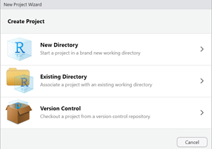
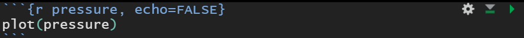
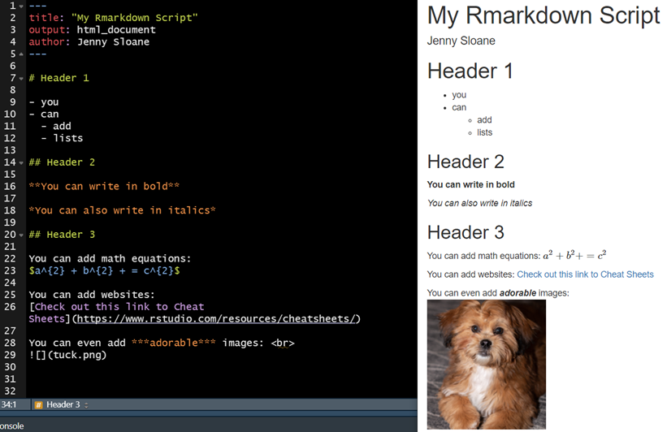

---
authors:
- admin
date: "2021-09-06T00:00:00Z"
draft: false
featured: false
image: 
  caption: "All Artwork by @allison_horst"
  focal_point: ""
projects: []
subtitle: 
summary: This blog is for those of you who are just beginning your R journey
tags: []
title: "Introduction to R"
toc: true
output:
  blogdown::html_page:
    toc: true
---
<!-- have to knit first if .Rmd --> 
<!-- for step by step guide to get a sticky floating header. make sure to remove index.html if that exists. Also in config.yaml have to set TOC to start from level 1 https://mickael.canouil.fr/post/floating-toc-in-blogdown/#modify-the-layout -->
<!-- in order to be able to get toc: true or toc: false, had to use code from CharlieLeee https://github.com/wowchemy/wowchemy-hugo-themes/issues/1520#issuecomment-601982609 for the single.html and I'm not sure why, but also only worked if file saved as .md not .Rmd -->

<style type="text/css">

body {
  font-size: 14pt;
}

p1 {
  font-size: 12pt;
  font-weight: bold;
}


h1 { /* Header 2 */
    font-size: 32px;
    color: DarkBlue;
    font-weight: bold;
}

h2 { /* Header 1 */
  font-size: 24px;
  color: #9d3ae8;
  font-weight: bold;
}

h3 { /* Header 2 */
  font-size: 24px;
  color: #9d3ae8;
  font-weight: bold;
}

</style>

# My Experiences Teaching R

<p1> During my years as a PhD student, I've had the pleasure to teach hundreds of students in several different psychology courses. However, my favorite courses have involved teaching R to students - many of whom had never even heard or R before. The first time I taught R was to a group of extremely motivated high school students during an intensive summer school program called SciX (Science Extension Program) in January 2021. You can check out my blog on SciX for more details [here](https://jennysloane.netlify.app/blog/scix/). </p1>

<p1> A few months later I had the opportunity to be a tutor/Teaching Assistant for a "Psychology Research Internship" course for uni students. In the course, students learned all about open science and reproducibility. In fact, students had the daunting task to try to reproduce plots **in R** from open source, published papers. Every week I ran 1 session that was dedicated to teaching the students new features, packages, and functions in R and 1 session that was dedicated to answering any questions the students had or troubleshoot error messages. In just 10 weeks, students went from not knowing a single thing about R to creating beautiful visualisations and submitting their final reports in Rmarkdown. Their final reports included all of their code and progress from along the way and it was absolutely amazing to see! It was definitely one of the most rewarding experiences for me as a teacher. </p1>

<p1> After teaching these courses, I'm keen to share everything I learned about teaching R as I'm sure there are many people out there who have heard about R or want to learn, but have no idea where to start. If this is you, I hope you find this blog helpful! </p1>

<p1> In this blog I'll cover what I believe to be the most essential things in order to get started on your coding journey. Of course I won't be able to go into too much detail on any one topic, but I'll provide incredibly useful resources :books: along the way. </p1>

# Installing R and RStudio

- R is a free, open source programming language that is often used for statistical and data analyses and visualizations
- RStudio is an IDE (integrated development environment) for R
- *You will need to install/download both R and RStudio*

- You can install **R** from the [CRAN (Comprehensive R Archive Network) website](https://cran.r-project.org/). I suggest downloading the latest version, which (as of the time of writing this blog) is R 4.1.1
  - [R for Windows link](https://cran.r-project.org/bin/windows/base/)
  - [R for Mac link](https://cran.r-project.org/)
- You can download **RStudio** [here](https://www.rstudio.com/products/rstudio/download/)
- Although you need to have R installed, you will mostly likely never need to open R because you can do everything you need in RStudio

# Getting familiar with RStudio

There are 4 panes you will quickly become very familiar with within RStudio

1. Top Left: This is the **Source Editor** where you write scripts 
    - To test it out, you can go File &rarr; New File &rarr; R Script 
2. Bottom Left: This is the **Console** where you can type code that you want to run one time and don't want to save it to a script. If you run a line of code in a script, depending on your settings, you may see the output in your console
3. Top Right: There are quite a few tabs here, but the most important tab for beginners is the **Environment** tab where you can see all of your saved variables and objects
4. Bottom Right: There are also several tabs here, but here you can see:
      - **Files** that are located within your working directory
      - Your beautiful **plots** and visualizations
      - **Packages** that you already have or would like to install
      - **Help** documentation. This is a really great built in feature to help you understand specific functions. To test this out type `?mean` into the console and you will see the documentation for the mean() function. This is incredibly useful to see what the function looks like, including what arguments it takes, and often there will be examples at the bottom of the documentation with code for you to test out the function.

<p1> :books: Recommended resource: [R-Ladies Sydney RYouWithMe BasicBasics Tutorial](https://rladiessydney.org/courses/ryouwithme/01-basicbasics-1/) </p1>

<p1> Tip: Want to work in dark mode or change your color theme? Navigate to: Tools &rarr; Global Options &rarr; Appearance and test out different color themes (I use "Tomorrow Night Bright") </p1>

# Working Directory

Before getting started with some coding, it's important to understand what a working directory is. 

- **What is a working director?** A working directory (wd) is the location where R will look for files. This is where R believes you are located.  
- **How do you know what your wd is?** In the console type `getwd()` to see what's called your "current working directory". You may notice that this path will most likely align with the path at the top of the Files tab because, again, this is where R thinks you are located. If you want load in any files, you must be in the correct working directory or R will return an error saying `cannot open file x: No such file or directory`
- **How do you set your wd?** There are a few ways you can do this... 
  - Option 1 (not recommended): Session &rarr; Set Working Directory &rarr; Choose Directory and navigate to find the correct folder 
  - Option 2 (also not recommended): `setwd()` to manually enter the path you want
  - Option 3 (highly recommended!): Create an **R Project** that will automatically set your wd 
  
# R Projects
- **What is an R Project?** An R project is just a way to keep all of your files associated with any given project together, organized, and easily accessible. If you wish to test out how to set up an R Project, following along with the next few steps. Take a look in the top right hand corner of RStudio and you will see a blue R cube. Assuming you haven't already created a project, it will say "Project: (None)". To create a new project, click on that and select New Project. You will see the following options:

 

This is where you decide where you want your project to be located. If you already have an existing folder choose "Existing Directory" and navigate to the correct folder and create your project. If you want to create a new folder choose the "New Directory" and New Project. Here you will have to create a name for your directory and again select where you want your project to be located and then Create Project. We won't worry about the version control option for now, but you may find it super handy, especially if you use GitHub. 

Once you've created your project, I suggest closing out of RStudio and navigating to your files where you just saved your project. You should see the familiar looking R cube with your directory name. Now all you have to do to open your project is double click on this R cube. RStudio will automatically open and you can type `getwd()` in the console to confirm you're in the correct location and you files will be in the Files tab. If you followed along with these steps, congrats on setting up your first R project! :smile:

# R Scripts
Now that we've covered some of the basics, let's write our first R script! 

To start, click File &rarr; New File &rarr; R Script. Let's first save our script by clicking on the save icon or ctrl/cmd + S. As I'm not very creative... I'll call my script "r_script". 

<p1> One important note here: it's best practice to avoid using spaces when naming scripts or folders. If you use spaces, you will probably eventually run into an error message, so best to avoid white spaces altogether. </p1>

I recommend saving this in the same location as your R Project so it's all in the same place and easy to find. If you click on the Files tab, you should see your script is now there! For me, I now have a file called `r_script.R` - notice it has automatically added the extension .R as it's an R Script. You can also see it says `R Script` in the bottom right corner of your Source Editor. 

Great, let's start coding!


```r
# type or copy the following code into your script:
print("My first script!!") 

10 + 20 + 30

x = 1 + 2 + 3
```

Okay a few things to go over here:

  - Anything written after a # is "commented out". This means R won't read or evaluate anything following a #. This is perfect for leaving comments or notes to yourself like I have done above
  - To run your entire script, click Source and then Source with echo (echo will print out your code along with the output) 
    - You should see that the first line of code printed "My first script!!" 
    - The second line of code printed the output "60"
    - But, the last line of code didn't print any output. This is because the last line we are defining a variable "x". So, although nothing is printed in our console output, check out your Environment - you should see you now have your variable "x" saved there and it's value is 6! 
    - Because you have x saved in your environment, now if you type x in your console, you will see the output
  - You can also run your script line by line. One way to do this is put your cursor on the line you want to run and click the green Run button. Or, put your cursor on the line you want to run and press ctr (or cmd) + enter. You'll see your cursor moves down a line automatically after you run one line. So if you start at the top of your script and press and hold down ctrl and press enter 3 times, all 3 lines of code will run.
  
# R Markdown 

When I started coding, I only used R scripts. But then I discovered R Markdown and now I use .Rmd scripts exclusively. R Markdown is a great way to create beautiful reports with a mix of text/notes and code. R Markdown files can also be easily converted to html, pdf, or word docs. 


So, now let's create our first Rmarkdown script! 

Click File &rarr; New File &rarr; R Markdown.. and enter a title for your script - I'll title mine "My Rmarkdown Script" (note: the title here can have spaces). I'll stick with the default HTML format, so then can click Okay. Notice now that the bottom right hand corner of the source editor now says `R Markdown`. Even though we created our file and provided a title, we still have to save our file. I'll save mine as `rmd_script` and the .Rmd extension will again be added automatically.

When we created our .R script, we had a blank script, but now we see that we are provided with a default template. There are 4 things I want to quickly point out here, but will go into more detail of each below. 

1) The **YAML** header section: this is located at the top of our markdown file, enclosed by `---`
2) **R chunks**: if you want to write code, you have to create an R chunk, which will always have this formatting: \```{r }...```. This is an example of one:

 

3) All other space: everything outside of the YAML and R chunks is for writing text. Remember, R Markdown is a meant for integrating content/text along with code. So, everything here will be text written in the markdown language and there's no need for the # like we needed in our R script. 

4) You may have noticed in our .Rmd script (at the top) we have a new `Knit` button that we didn't have in our .R script. Go ahead and press this button to watch R knit your file from R to html (because that's what we've specified the output to be). Your "knitted" file will either appear in the Viewer pane or in a new window depending on your settings. Here we see we have our title, some text, some code, and even a plot! Pretty cool right?! 

<p> Now, let's spend a little more time discussing each of these sections in more detail. </p>

## YAML Section
In our default YAML, we already have a `title` and `output` specified. There are other arguments you can add here, such as `author` or `date`. Let's add the author argument to test it out. <br>

Try knitting your file again. Now you should see your name appear under the title.


```r
---
title: "My Rmarkdown Script"
output: html_document
author: Jenny Sloane 
---
```

<p1> Note: It's important to pay attention to spacing here. For example, if I had `author:Jenny Sloane` without the space I would have issues with knitting my document. </p1>

## R Chunks
We already have a few chunks created for us in our template. In any code chunk, you'll see a few buttons in the top right corner: an options/gear button and 2 arrows. The gear button allows you to modify chunk options (I don't think I've ever used this). Next to the gear button, there's an arrow pointing down, which if you click it will run all of the chunks *above* the current chunk. Finally, the green arrow pointing to the right will run all of the code within that current chunk. Of course you can also run your code line by line the same way as we did in the .R scripts (I usually navigate to the chunk I want to work on, press the arrow pointing down, and then run my code line by line by pressing ctrl + enter). 

R chunks have certain options you can set. For example, if you want the actual code to appear in your knitted document, you can set `echo=TRUE` and if you only want the output to appear and no code you can set `echo=FALSE`. Other chunk options that I often use are: `include`, `warning`, `message`, and `eval`. 

The first chunk you see in the template is a little bit different. While this chunk is not necessary and you can remove it if you'd like, this is where you can set global chunk options. For example, you can see echo is set to TRUE here, so this means all of the code will appear in your knitted document. You can override the global chunk settings by directly adjusting the options in any specific chunk. 


As a small aside, you may have noticed next to the `r` in the first chunk it says "setup". This is where you can set a "name" for you chunk, so it makes sense that this chunk is called setup. This is just another way to help keep your code and report organized. 

<p1> Fun (and helpful) fact: in the top right hand corner of the Source Editor there is a button that is a stack of line. I've heard this referred to as the "pancake button", which I love! If you click on the pancake button, you'll see an outline for your entire document! To use the outline feature, you simply have to include "headers" within your document. You can include headers by using # (see image below for examples). </p1>

<p1> :books: Recommended resource: Check out the R Markdown "Cheat Sheet" by going to Help &rarr; Cheat Sheets &rarr; R Markdown Cheat Sheet.

<p1> :books: Recommended resource: [Have a look at other existing cheat sheets here](https://www.rstudio.com/resources/cheatsheets/). </p1>

## Markdown
All text outside of the YAML and R chunks is written with `Markdown` syntax. You can easily style your text with bold and italics. You can add headers, lists, equations, links, images, and so much more. Below you can see what code looks like in R Markdown compared to what it looks like when it's knitted to a pdf. 

<p1> :books: Recommended resource: [A great YouTube playlist by Danielle Navarro on R Markdown](https://www.youtube.com/playlist?list=PLRPB0ZzEYegM86awo590bP1MJjQbjdR9E) </p1>

<p1> :books: Recommended resource: [https://bookdown.org/yihui/rmarkdown/](https://bookdown.org/yihui/rmarkdown/) is a great website to learn more about R Markdown. </p1>



# Tidyverse!!
I first learned R in base R, but once I learned about tidyverse there was no going back. There's so much I can say about tidyverse, but I'll only cover some of the basics and continue to provide resources along the way. 

## What is tidyverse?

Tidyverse is a collection of 8 packages (`ggplot2`, `dplyr`, `tidyr`, `readr`, `purrr`, `tibble`, `stringr`, `forcats`) introduced by Hadley Wickham to help with data manipulation, exploration, and visualisation. 
- Check out the [tidyverse website](https://www.tidyverse.org/packages/) to find out more details of each of the individual packages

## Installing tidyverse

Whenever you want to use a package, the first thing you have to do is install the package. Once you install a package, it will remain installed on your computer, so you only have to install it once (I always install packages in my console as there's no need to save it to a script)

- The code to install tidyverse looks like this `install.packages("tidyverse")`
- The install.packages() functions will install packages that are part of CRAN (Comprehensive R Archive Network)

### Installing non-CRAN packages
- However, not all packages are part of CRAN (especially one's that are still in development). If you get a warning like the `package ‘xxx’ is not available for this version of R`, that's a good indication that it's not on CRAN. 
- If it's not on CRAN, you'll need to locate the repository on GitHub and install via `devtools`. 
  - For example, if I wanted to install the package "emo" for emojis :tada: , I would type in something like "emo package R" into Google and search for the GitHub page, which would be [https://github.com/hadley/emo](https://github.com/hadley/emo). There are instructions for how to install the package in the ReadMe document if you scroll down on the page. 

<p1> :books: Recommended resource: Here's a great blog on ["R Package Install Troubleshooting""](https://www.littlemissdata.com/blog/r-package-install)

## Loading tidyverse

It's not enough to just install the package. Every time you start a new R session, you need to load in the packages you wish to use, so I always put this code within my script as it needs to run every session.
- The code to load the package looks like this: `library(tidyverse)`
- Whenever you load tidyverse, you will see a message saying it's attaching all 8 packages. Therefore, you don't have to load in any of the individual packages because they all get called in together. This means as long as you load in tidyverse, you can use functions from any one of the 8 packages. 

So, you can think about it as having an entire library of all the packages you've ever installed. But, in each script and session you need to specify which libraries (aka packages) you want to load in. 

<p1> Note: when you install packages you need to use " " around the package name, but you don't need to when you call in the library. </p1>

## The Pipe `%>%`

This is the pipe operator: `%>%`

If you use tidyverse, you will quickly become very familiar with this operator. You use the pipe when you want to execute multiple operations in a specific sequence. To me, it makes sense to think about the pipe as "AND THEN". 

For example:

```r
I want to do x AND THEN
I want to do y AND THEN
I want to do z
```

which is equivalent to:

```r
I want to do x %>%
I want to do y %>%
I want to do z
```

For a real example, let's look at some code below. In the code, we'll first load in `tidyverse` and the `palmerpenguins` libraries (you may need to install it if you've never used it before). With the `palmerpenguins` package, there's a built in `penguins` dataset that we'll explore. 


```r
library(tidyverse)
library(palmerpenguins) 

head(penguins) # gives us the first 6 rows of our dataset
```

```
## # A tibble: 6 x 8
##   species island bill_length_mm bill_depth_mm flipper_length_~ body_mass_g sex  
##   <fct>   <fct>           <dbl>         <dbl>            <int>       <int> <fct>
## 1 Adelie  Torge~           39.1          18.7              181        3750 male 
## 2 Adelie  Torge~           39.5          17.4              186        3800 fema~
## 3 Adelie  Torge~           40.3          18                195        3250 fema~
## 4 Adelie  Torge~           NA            NA                 NA          NA <NA> 
## 5 Adelie  Torge~           36.7          19.3              193        3450 fema~
## 6 Adelie  Torge~           39.3          20.6              190        3650 male 
## # ... with 1 more variable: year <int>
```

```r
levels(penguins$island)
```

```
## [1] "Biscoe"    "Dream"     "Torgersen"
```

```r
levels(penguins$species)
```

```
## [1] "Adelie"    "Chinstrap" "Gentoo"
```

From quickly looking at the levels of a couple of variables, we can see there are 3 islands (Biscoe, Dream, Torgersen) and 3 species (Adelie, Chinstrap, Gentoo). 

I like the idea of a "Dream" island, so the question I'll ask here is: 

<center>
<strong>What is the mean body mass for female and male Adelie penguins on Dream island?"</strong>
</center>
<br>

Here's the code to answer my question and below I'll go through the pipes line by line:

```r
penguins %>%
  select(species, island, body_mass_g, sex) %>% # step 1
  filter(species == "Adelie" & island == "Dream") %>% # step 2
  group_by(sex) %>% # step 3
  summarise(mean_body_mass = mean(body_mass_g)) %>% # step 4
  drop_na() # step 5
```

```
## # A tibble: 2 x 2
##   sex    mean_body_mass
##   <fct>           <dbl>
## 1 female          3344.
## 2 male            4046.
```

- Step 1: First, from the penguins data, I'm selecting only the variables I'm interested in AND THEN...
- Step 2: I'm filtering my data to only have the Adelie species and only from Dream island AND THEN...
- Step 3: I'm grouping by sex in order to get an average body mass calculation for males and females AND THEN...
- Step 4: I'm summarizing my data to get the mean body mass AND THEN...
- Step 5: I'm dropping the NA values

And finally, we see our output: the mean body mass for females Adelie penguins on Dream island is 3344 grams and 4046 grams for males

<p1> Of course, it takes time and practice to learn the different functions within tidyverse. But, these are some of the `dplyr` functions I use all the time (i.e. `select()`, `filter()`, `group_by()`, `summarise()`, and `drop_na()`). </p1>

<p1> Tip: To adjust some R Markdown settings go to Tools &rarr; Global Options &rarr; R Markdown. For example, I have my preferences set to "Show output in: Viewer Pane" as opposed to a new window and personally, I like when the output is printed in the console, rather than inline, so I have "show output inline for all R Markdown documents" unchecked. </p1>

<p1> :books: Recommended resource: [R-Ladies Sydney RYouWithMe "CleanItUp" Tutorial](https://rladiessydney.org/courses/ryouwithme/02-cleanitup-0/) </p1>

<p1> :books: Recommended resource: [Another fabulous YouTube playlist by Danielle Navarro "say hello to your data"](https://www.youtube.com/playlist?list=PLRPB0ZzEYegPYKRLwJRh4AbWWSiIlzmC7) </p1>

# My Workflow
In this final section, I thought I'd share some tips and an example of my workflow in R. There are many free datasets you can explore within R (e.g. mtcars, iris, penguins from the palmerpenguin package). However, for this blog, I've downloaded a dataset from [Kaggle](https://www.kaggle.com/arjunprasadsarkhel/2021-olympics-in-tokyo) on the medal standings from the Tokyo Olympics.

<center>
<strong>Research Question: "Which countries (top 5) won the most medals?"</strong>
</center>
<br>

Usually when I use R, I have a folder within the root of my project titled "data" and of course this is where I keep the actual data files. This just helps me keep my project more organized and I always know exactly where my data is. So, I've done the same thing here - I created a data folder and saved my `medals.csv` file there. Note, that this is now one folder "deep" into our project. What this means is that we have to let R know to look inside the "data" folder in order to find our .csv file because it's not located at the root of our project. But don't worry, this is easy to do, especially if you know about the `here` package.

Below I'll show you my typical workflow using the medals dataset. 

## Load in libraries

```r
library(tidyverse)
library(janitor) 
library(here)
library(ggeasy) # this is an awesome package to help customize ggplots with easy to remmeber functions
```

- My first chunk of code is always dedicated to loading in all of the libraries I need for my entire script 
- I make sure the chunk options include `message=FALSE` and `warning=FALSE`, so when I knit the file I don't see all of the messages and warning from loading in the respective libraries


## Read in data 

```r
medals_raw <- read_csv(here("data", "medals.csv"))
# medals_raw <- read_csv("data/medals.csv") # this will also work, if you wish to specify the path directly 

head(medals_raw) # look at only the top 6 rows
```

```
## # A tibble: 6 x 7
##    Rank `Team/NOC`                  Gold Silver Bronze Total `Rank by Total`
##   <dbl> <chr>                      <dbl>  <dbl>  <dbl> <dbl>           <dbl>
## 1     1 United States of America      39     41     33   113               1
## 2     2 People's Republic of China    38     32     18    88               2
## 3     3 Japan                         27     14     17    58               5
## 4     4 Great Britain                 22     21     22    65               4
## 5     5 ROC                           20     28     23    71               3
## 6     6 Australia                     17      7     22    46               6
```

- `read_csv()` is very similar to `read.csv()`, except it will automatically read your data in as a tibble (a "tidy" dataframe). For this reason, I exclusively use `read_csv()`
- I use the `here()` function to tell R that I want it to go within the "data" folder I just created in order to find the "medals.csv" file
- We can take a look at the first 6 rows of our raw data using `head()`

<p1> :books: Recommended resource: [How to use the `here` package by Jenny Richmond](http://jenrichmond.rbind.io/post/how-to-use-the-here-package/) </p1>

## Clean our data 

```r
medals_top5 <- medals_raw %>% # create a new variable with our results
  clean_names() %>% # step 1
  select(team_noc, total) %>% # step 2
  arrange(desc(total)) %>% # step 3
  top_n(5) # step 4
```

- Step 1: When looking at the data, the first thing I notice is the variable names could be "cleaner". 
    - We always want to try to avoid white space, so we'll want to change our variable "Rank by Total". Programmers have their own style of coding in order to avoid white space. For example, there's "snake_case" (Rank_by_Total) or "camel case" (rankByTotal) or "kebab case" (Rank-by-Total). 
    - My preference is snake case and I also make sure my variables are all lowercase (mainly because, like most programmers, I'm lazy and it's much easier to type lower case letters than capital letters)
    - Fortunately, `janitor::clean_names()` does all of this for me in just one line of code!
    - So, here I'll use the `clean_names()` function to remove white space and transform everything to lower case
- Step 2: Select only the columns/variables I need in order to answer my research question. This will make your life so much easier, especially if your dataset has dozens or even hundreds of variables 
- Step 3: Arrange the total column in descending order
- Step 4: Select only the top 5 rows... I've actually never heard of `top_n()` before, but I just did a quick Google search and found it!

And here we're simply printing out our results:

```r
medals_top5
```

```
## # A tibble: 5 x 2
##   team_noc                   total
##   <chr>                      <dbl>
## 1 United States of America     113
## 2 People's Republic of China    88
## 3 ROC                           71
## 4 Great Britain                 65
## 5 Japan                         58
```

## Visualise our results
Finally, let's create a visualisation using ggplot!
- Notice that we use the `+` sign rather than the `%>%` when using ggplot. This may get a little bit confusing at first, but this may be helpful: when using ggplot, think about it as each line is **adding** a new layer to your plot

```r
ggplot(medals_top5, aes(x = reorder(team_noc, total, sum), y = total, fill=team_noc)) + # I've reordered the columns based on the sum of the total variable 
  geom_col() + 
  coord_flip() + # flips the cartesian coordinates to make it easier to read the country names
  labs(x = "Country", y = "Total Medals") + # you can also add a "title" here if you'd like
  theme_bw() + # there are several default themes but I like this one 
  easy_remove_legend() + # one of my favorite functions from ggeasy to remove the legend
  easy_text_size(15) # another one of my favorite functions from ggeasy to change the text size
```

}}index_files/figure-html/unnamed-chunk-12-1.png" width="672" />


<!--  -->
