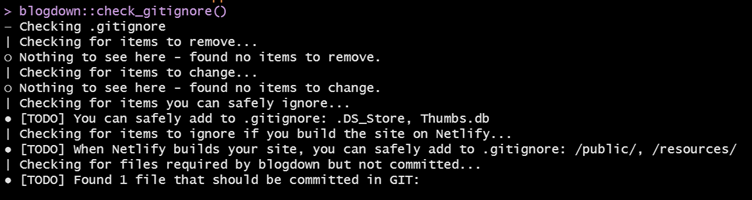

---
authors:
- admin
categories: []
date: "2021-06-17T00:00:00Z"
draft: false
featured: false
image: 
  caption: ""
  focal_point: ""
projects: []
subtitle: 
summary: This blog is a step-by-step guide to building websites in R using blogdown
tags: []
title: R blogdown
---

- This blog post is to help others build a website for the first time! (...and also to remind me of all the steps if I ever need to build another website in the future)
- I made this website and also helped to build the [UNSW CodeRs website](https://unsw-coders.netlify.app/) using blogdown
- I also highly recommend checking out Alison Hill's blogdown [blog](https://alison.rbind.io/blog/2020-12-new-year-new-blogdown/). This is an incredibly useful resource and definitely helped me learn how to use blogdown

## To create your website, you will need: Rstudio, Git, Github, and Netlify

- Rstudio: you can make changes to the content and serve the site locally
- Github: version control and syncs with Netlify
- Netlify: Builds and publishes the website using your Github repository

## Rstudio, Git, Github Setup

- **Rstudio and Git must be installed**
- Login to Github or create an account and create a new repository with a readME file
- Click on the green Code button where you would go to download the repo, and click on the clipboard to copy the HTTPS url
- In Rstudio, go File &rarr; New Project.. &rarr; Version Control &rarr; Git &rarr; and paste the url that you copied from github (this will create an empty project with just your readME file)

## Rstudio 
- Install blogdown and hugo (you may need to install devtools also)

```{r message=FALSE, warning=FALSE, eval=FALSE}
install.packages("blogdown")
library(blogdown)

install_hugo()
```

- Now you have to choose your hugo theme, so go to [https://themes.gohugo.io/](https://themes.gohugo.io/) and choose the theme you want 
- For the academic theme, select "Academic", click homepage, select "Skills" and then star on github. Copy the full repository name "wowchemy/starter-academic"
- Go back to Rstudio to create your site with your selected theme. Just paste the theme name in like below
- Type y to serve and preview the site
- This may take a little while because it has to create the entire site. When it's done, you'll see all the files appear in Rstudio 

```{r eval=FALSE}
new_site(theme = "wowchemy/starter-academic")
```

- If you wish to stop serving your site, use this code:
```{r eval=FALSE}
stop_server()
```

- Next, you have to edit add a couple of lines to .gitignore (see code below)
```{r eval=FALSE}
file.edit(".gitignore")

# make sure you have all of this (you'll need to add the last 2 lines):
.Rproj.user
.Rhistory
.RData
.Ruserdata
.DS_Store 
Thumbs.db 

blogdown::check_gitignore() # check that everything is good to go
```



- Notice the TODO - "When Netlify builds your site, you can safely add to .gitignore: /public/, /resources/"
- So, add public and resources to your .gitignore file and then check the content
```{r eval=FALSE}
# again, add the last 2 lines:
.Rproj.user
.Rhistory
.RData
.Ruserdata
.DS_Store
Thumbs.db
/public
/resources

check_content()
```

## Stage, Commit, Push to Github

- Now go to Tools &rarr; shell and you'll see you're already in the correct directory
- The first time you **stage** everything you want to do it through the shell because there's so much. I've found it sometimes crashes if you try to stage too much through RStuido
- If this is your first time using Git, you'll need to enter your github details
- In the shell enter the following lines of code

```{r eval=FALSE}
git config --global user.name "jennysloane"
git config --global user.email "j.sloane@unsw.edu.au"
git add -A # this will add everything 
```

- Now you can close the shell 
- Back in Rstudio, click on **Commit** and everything should be checked off (because you've already staged everything in the shell). Leave a message (e.g. "First Commit") and click commit
- When you see the close button, you can click close 
- Finally, you want to **push** to github which may take a little while
- To make sure everything worked, go to your github account and check that it's all there
- ***Remember: Stage, Commit, Push***

## Netlify 

- Go to [Netlify](https://www.netlify.com/) and login or sign up (sign up through Github)
- Click New site from Git (may need to give permissions)
- Click Continuous Deployment select Github
- Select the project with your website repo
- You should be able to keep the basic build default settings (Build command: hugo)
- But click on show advance and select new variable
- Key = HUGO_VERSION and Value = 0.81.0 (go to RStudio and type `hugo_version()` to make sure you enter the correct version number)
- Deploy site! 
- This should take less than a minute 
- Click preview to see site
- Netlify builds the site, so you don't have to build the site in Rstudio. You can serve site in Rstudio while you're working to see the changes but use Netlify to build the site
- Every time you push changes to Github, Netlify will update your site (i.e. continuous deployment)
- To change your website name, go to Site Overview &rarr; Site Settings &rarr; Site information &rarr; Change site name
- Update your new url in rstudio and then you can check netlify and hugo

```{r eval=FALSE}
rstudioapi::navigateToFile("config.yaml") 

check_netlify()
check_hugo()
```

## Your website should be up and running now :) 