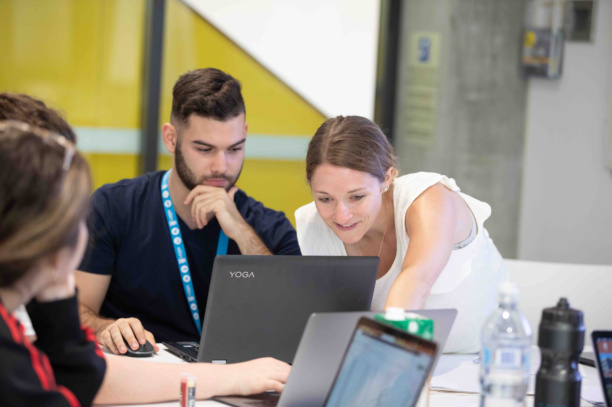
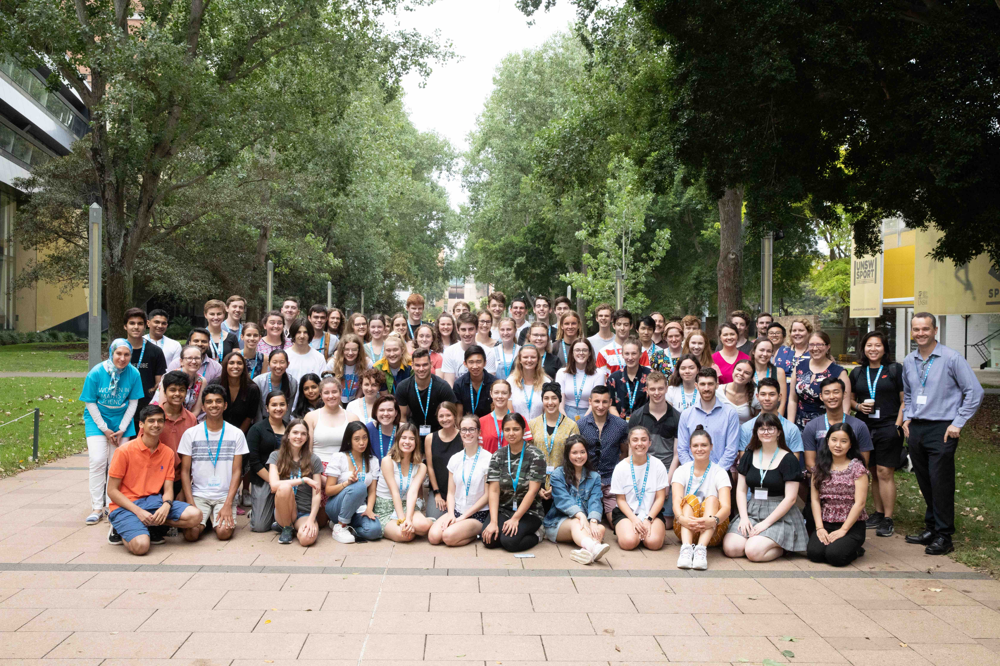

---
authors:
- admin
categories: []
date: "2020-03-24T00:00:00Z"
draft: false
featured: false
image: 
  caption: ""
  focal_point: ""
projects: []
subtitle: 
summary: This is my blog on my experience as a PhD mentor for UNSW's SciX program
tags: []
title: SciX
---

From January 20-24, close to 100 bright, motivated, and eager high school students from across the country came to University of New South Wales to participate in SciX. The SciX program was designed for year 12 students who are enrolled in the Science Extension program (hence the name SciX) to come to campus for an intensive week of attending workshops and research labs. Students applied to over a dozen projects they were interested in on the SciX website. There were many different projects ranging from modeling infectious disease to research on climate change. The full list of projects can be found on the link above. 

Once students were accepted into the program, they began working with a PhD mentor to complete online assignments to prepare them for the summer school in January. Working with Dr. Steven Most, I had the pleasure of mentoring 5 incredible high students in the Cognitive Science project. As the PhD mentor, my responsibilities included: co-designing the research project, creating the online pre-summer school assignments, coding the experiment, and teaching 10 in-person research labs

During the one week long summer school, students working with me would 1) finalize their hypotheses 2) collect data online for a series of cognitive tasks 3) analyze the data 4) interpret their findings and 5) deliver a 5 minute formal presentation. Thinking about it now, this seems absolutely insane to try to complete in less than a week. These are the same steps I would follow when designing and conducting an experiment for my thesis. The only difference is I would typically spend an entire semester working on one experiment. We only had 4 days!

Our experiment consisted of 3 cognitive tasks (<a href = "https://expfactory-experiments.github.io/cognitive-reflection-survey/" >Cognitive Reflection Test</a>, <a href = "https://expfactory-experiments.github.io/flanker/" >Flanker Task</a>, Random Dot Motion Paradigm), 3 surveys (impulsivity, self-control, Big 5 personality test), and a few demographic questions. You can click the links to test out a couple of the cognitive tasks. Students all came up with unique hypotheses. For example one student’s hypothesis was higher scores on the self-control survey will correlate with greater performance on the Cognitive Reflection Test. I was very impressed with the students’ hypotheses. 

Now, in order to successfully make it through the week, I did a lot of behind the scenes preparation. So by the start of the summer school the experiment was programmed and ready for data collection. We had a total of 10 1.5 hour labs where we covered topics, such as pre-registration, MTurk (the online platform we used to collect data), ethics, and statistics. 

However, we spent most of our time analyzing the massive dataset. Just to give you a sense of the size of our dataset, there were 34,444 rows and 120 columns of data. In order to make it slightly less overwhelming for the students, I created mini datasets for each student that had all of the variables and information they needed to explore their respective hypotheses. Students used excel and a statistical program called Jamovi (which they learned about in the pre-summer school work) to carry out all of their statistical analyses.

My favorite part of the week was watching the students put together their final presentations and seeing how excited they were about their results. I also loved listening to presentation given by students in other projects. One group designed models of aircraft wings and using a 3D printer, they were able to physically test their wings in a wind tunnel on campus. It is truly amazing how much these high school students accomplished in one week. 

Although it was a big time commitment and a challenge trying to help 5 students who were all working on separate research questions and who had never heard of Jamovi before, seeing the student presentations at the end of the week made it all worth it. Plus, the students remained incredibly enthusiastic and eager to learn throughout the entire week, which made it an absolute pleasure to teach and mentor them. I’m already looking forward to SciX 2021!

